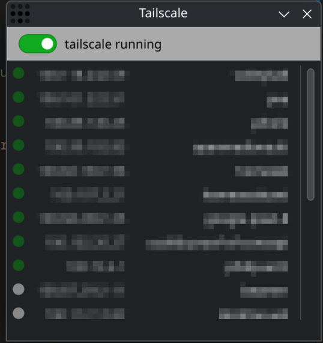

# Tailslint

Wrapper for Tailscale CLI using [Slint](https://docs.slint.dev/latest/docs/slint/), build in Rust.



## Building

```bash
cargo build --release
```

## Running

```bash
sudo tailscale set --operator=$USER # use tailscale without root
./target/release/tailslint

#or
sudo cp ./target/release/tailslint /usr/local/bin/
tailslint
```
